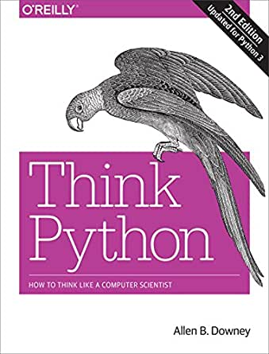

---
jupyter:
  jupytext:
    formats: ipynb,md
    text_representation:
      extension: .md
      format_name: markdown
      format_version: '1.2'
      jupytext_version: 1.9.1
  kernelspec:
    display_name: Python 3
    language: python
    name: python3
---

<!-- #region -->
$$
\def\CC{\bf C}
\def\QQ{\bf Q}
\def\RR{\bf R}
\def\ZZ{\bf Z}
\def\NN{\bf N}
$$

# 《Think Python 2e》中文Jupyter笔记

> [Think Python 2nd Edition](https://github.com/AllenDowney/ThinkPython2) by Allen B. Downey

> 根据[《Think Python 2e》最新版中文翻译by bjingjin](https://github.com/bingjin/ThinkPython2-CN)转换校对

> By JumboJing
<!-- #endregion -->

## 目录

* [前言](docs/00_preface.ipynb)
* [第一章：程序之道](docs/01_the_way_of_the_program.ipynb)
* [第二章：变量、表达式和语句](docs/02_variables_expressions_and_statements.ipynb)
* [第三章：函数](docs/03_functions.ipynb)
* [第四章：案例研究：接口设计](docs/04_case_study_interface_design.ipynb)
* [第五章：条件和递归](docs/05_conditionals_and_recursion.ipynb)
* [第六章：有返回值的函数](docs/06_fruitful_functions.ipynb)
* [第七章：迭代](docs/07_iteration.ipynb)
* [第八章：字符串](docs/08_strings.ipynb)
* [第九章：文字游戏](docs/09_case_study_word_play.ipynb)
* [第十章：列表](docs/10_lists.ipynb)
* [第十一章：字典](docs/11_dictionaries.ipynb)
* [第十二章：元组](docs/12_tuples.ipynb)
* [第十三章：案例研究：数据结构选择](docs/13_case_study_data_structure_selection.ipynb)
* [第十四章：文件](docs/14_files.ipynb)
* [第十五章：类和对象](docs/15_classes_and_objects.ipynb)
* [第十六章：类和函数](docs/16_classes_and_functions.ipynb)
* [第十七章：类和方法](docs/17_classes_and_methods.ipynb)
* [第十八章：继承](docs/18_inheritance.ipynb)
* [第十九章：进阶小技巧](docs/19_the_goodies.ipynb)
* [第二十章：调试](docs/20_debugging.ipynb)
* [第二十一章：算法分析](docs/21_analysis_of_algorithms.ipynb)

